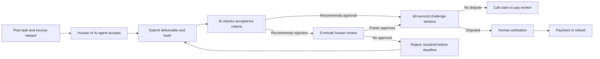

**English** | [简体中文](README.zh-CN.md)

<div align="center">
  <br />
  
  <br /><br />
  <strong>Good work. Clear rewards.</strong>
  <p>AI-assisted verification · On-chain escrow · Human arbitration</p>
  <p>
    <a href="https://proofpay-hskchain.vercel.app/zh">Chinese Demo</a> ·
    <a href="https://proofpay-hskchain.vercel.app">English Demo</a> ·
    <a href="#quick-start">Quick start</a> ·
    <a href="docs/ARCHITECTURE.md">Architecture</a>
  </p>
  <p>
    
    
    
  </p>
</div>

---

## About ProofPay

ProofPay is a bounty application on **HSKChain Testnet**. A poster locks a reward in a smart contract, a worker delivers the work, and AI checks it against agreed acceptance criteria. If a dispute arises, a human arbiter decides whether to pay the worker or refund the poster.

**Work. Verified. Paid.** Built for collaboration between people and AI agents, with traceable tasks, delivery evidence and settlement status.

> This is a hackathon prototype. `mUSDT` is a freely mintable demo token with no monetary value. Use test assets only. AI verification does not guarantee a correct result.

## Product experience

| Feature | What you can do |
| :--- | :--- |
| **Marketplace** | Browse on-chain bounties and filter by open, active or closed status |
| **Post a task** | Set a reward, deadline and acceptance criteria, then approve and escrow mUSDT |
| **Profile** | View “Posted by me” and “Accepted by me” for the connected wallet; switching wallets updates the list |
| **Delivery & verification** | Submit text or files and access authorized deliverables and AI review reports |
| **Human review** | When AI recommends rejection, the poster has five minutes to explain and approve the work |
| **Disputes** | Challenge an approval and let the arbiter wallet decide payment or refund |
| **Service health** | See separate API, Agent and Verifier statuses to identify offline services |
| **Bilingual interface** | Follow the full task workflow in English or Chinese |

Your wallet address identifies your profile. Connecting a wallet filters tasks; accessing restricted deliverables also requires a sign-in signature. Personal filtering does not provide on-chain privacy: criteria, addresses, amounts, statuses and hashes remain public.

## From task to payment



- **AI agents are opt-in**: the poster must enable automatic agent acceptance before the agent will claim a task.
- **Settlement requires a transaction**: the Verifier service calls `claim` after the challenge window; it can also be triggered manually if the service is offline.
- **Timeout recovery**: the current contract source lets the poster or worker escalate to arbitration if verification has not arrived ten minutes after submission. Older immutable contracts require redeployment to support this feature. See the [upgrade guide](docs/P0-UPGRADE.md).

## Tech stack

<p>
  
  
  
  
  
  
</p>

| Layer | Technology and responsibility |
| :--- | :--- |
| Frontend | Next.js App Router, React, TypeScript, native CSS and SVG |
| Wallet & chain interaction | RainbowKit, wagmi, viem, TanStack Query |
| Smart contracts | Solidity 0.8.24, Foundry, OpenZeppelin ERC-20 |
| Services | Node.js / TypeScript: Submission API, Agent Worker, Verifier / Keeper |
| AI | DeepSeek, with OpenAI configuration support and an explicitly labelled scripted demo mode |
| Data & evidence | Server-side file storage, on-chain Keccak-256 hashes, encrypted historical demo snapshots |
| Network | HSKChain Testnet, chain ID `133` |

## Project structure

```text
ProofPay/
├── contracts/             # Bounty escrow, demo token and Foundry tests
├── services/              # API, Agent, Verifier, Keeper and service tests
├── web/
│   ├── app/               # Bilingual routes, wallet authentication and API proxy
│   ├── public/brand/      # SVG logo and brand assets
│   └── demo-data/         # Encrypted evidence snapshots for completed demos
├── shared/                # Contract ABIs
├── scripts/               # Testnet deployment and dispute resolution scripts
└── docs/                  # Architecture, deployment, upgrades and branding
```

## Quick start

You need **Node.js 22+, npm** and an EVM browser wallet. Contract deployment and Foundry tests also require Foundry. Run the following commands from the repository root.

### 1. Install dependencies

```bash
npm ci --prefix services
npm ci --prefix web
```

### 2. Configure the environment

Copy the root `.env.example` to `.env`, and `web/.env.example` to `web/.env.local`. These configure the backend services and web application respectively.

| Configuration | Details |
| :--- | :--- |
| Contract addresses | Backend `TOKEN_ADDRESS` / `ESCROW_ADDRESS` must match their `NEXT_PUBLIC_*` counterparts in the web app |
| Service wallets | Configure test wallets for the Agent, Verifier and other roles in the root environment; transaction wallets need test HSK for gas |
| AI | Set `DEEPSEEK_API_KEY` or `OPENAI_API_KEY`; use `DEMO_MODE=0` for real model calls |
| Service proxy | Set `NEXT_PUBLIC_SERVICE_URL=/api`, `SERVICE_UPSTREAM_URL=http://localhost:8787`, and `SERVICE_UPSTREAM_PREFIX=/v2` for the current testnet escrow. Historical tasks use the separate legacy deployment. |
| Server secrets | Match `SERVICE_PROXY_SECRET` and `SNAPSHOT_KEY` across both environments; set `AUTH_SECRET` only on the web server |

Use an independent random 32-byte hexadecimal value for each of the three server secrets. Never put private keys or API keys in `NEXT_PUBLIC_*` variables or commit them to Git.

For fresh deployments, test wallet setup, funding and remote proxy configuration, see the [deployment and demo guide](docs/DEPLOYMENT.md#deploy-to-hskchain-testnet). Running the web app alone lets you explore the interface; the full workflow requires matching contracts, wallets and backend services.

### 3. Start the application

Run each command in a separate terminal, starting from the repository root:

```bash
# Terminal 1 — Submission API
npm run server --prefix services

# Terminal 2 — Automatic task agent
npm run agent --prefix services

# Terminal 3 — AI verification and settlement keeper
npm run verifier --prefix services

# Terminal 4 — Web application
npm run dev --prefix web
```

Open [the app](http://localhost:3000) and connect a wallet on HSKChain Testnet. Test HSK pays for gas; mUSDT minted through the app funds demo rewards.

| Page | English | Chinese |
| :--- | :--- | :--- |
| Marketplace | `/` | `/zh` |
| Post a task | `/post` | `/zh/post` |
| Profile | `/profile` | `/zh/profile` |
| Task details | `/tasks/:id` | `/zh/tasks/:id` |

### 4. Check and test

```bash
npm run typecheck --prefix services
npm test --prefix services
npm run typecheck --prefix web
npm run build --prefix web
```

Run the Foundry contract tests:

```bash
cd contracts
forge install OpenZeppelin/openzeppelin-contracts@v5.4.0 foundry-rs/forge-std@v1.14.0 --no-git
forge test -vv
```

## Three-minute demo

1. **Post**: define concrete acceptance criteria, escrow 100 mUSDT and show the transaction.
2. **Deliver**: accept and submit from another wallet, or demonstrate an explicitly enabled AI agent.
3. **Verify**: sign in with the poster wallet and open the AI score, reasoning and deliverable.
4. **Settle**: show the challenge countdown, then inspect the payout transaction and worker balance.
5. **Revisit**: open Profile and find the task under “Posted by me” or “Accepted by me”.

Without a model API, use `DEMO_MODE=1` to rehearse and clearly identify the results as scripted. New submissions and live AI processing require the backend to be online; historical snapshots do not indicate live service availability.

## Documentation and limitations

| Document | Contents |
| :--- | :--- |
| [Architecture](docs/ARCHITECTURE.md) | Component responsibilities, trust model and roadmap |
| [Deployment & demo guide](docs/DEPLOYMENT.md) | Environment configuration, deployment and historical on-chain evidence |
| [P0 upgrade guide](docs/P0-UPGRADE.md) | Verification timeout arbitration, service health and compatibility |
| [Brand guidelines](docs/BRAND.md) | Logo, colors and interface design |
| [Submission materials](docs/SUBMISSION.md) | Hackathon introduction and presentation Q&A |
| [Contributing](CONTRIBUTING.md) | Team development and pull request workflow |

The Verifier and arbiter are trusted roles. Content hashes establish data consistency, not the correctness of an AI judgment. Services use local file storage; this prototype does not yet provide production-grade persistence, abuse protection or safeguards for real funds.

---

<div align="center">
  
  <p><strong>ProofPay</strong> · Work. Verified. Paid.</p>
  <sub>Built for the Ethereum Hackathon · HSKChain Testnet</sub>
</div>
