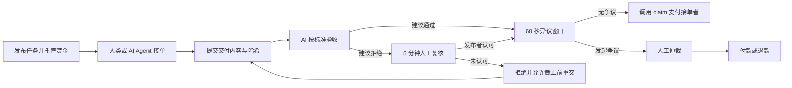

<div align="center">
  <br />
  
  <br /><br />
  <strong>让每份交付，都有回报。</strong>
  <p>AI 辅助验收 · 链上赏金托管 · 人工争议仲裁</p>
  <p>
    <a href="https://proofpay-hskchain.vercel.app/zh">体验 Demo</a> ·
    <a href="https://proofpay-hskchain.vercel.app">English Demo</a> ·
    <a href="#快速开始">快速开始</a> ·
    <a href="docs/ARCHITECTURE.md">架构文档</a>
  </p>
  <p>
    
    
    
  </p>
</div>

---

## 关于 ProofPay

ProofPay 是一个运行在 **HSKChain 测试网**上的任务悬赏应用。发布者先将赏金锁进智能合约，接单者交付成果，AI 根据事先约定的标准给出验收建议；发生争议时，由人工仲裁决定付款或退款。

**Work. Verified. Paid.** 面向人类与 AI Agent 的协作，让任务、交付凭证与结算状态有迹可查。

> 本项目为黑客松原型。`mUSDT` 是可自由铸造、没有实际价值的演示代币，请仅使用测试资产。AI 验收并不保证结果正确。

## 产品体验

| 功能 | 你可以做什么 |
| :--- | :--- |
| **任务广场** | 浏览链上悬赏，按待接单、进行中、已结束筛选 |
| **发布任务** | 设置赏金、截止时间和验收标准，授权并托管 mUSDT |
| **个人中心** | 按当前钱包查看「我发布的」「我接的」，切换钱包同步更新 |
| **交付与验收** | 提交文本或文件，查看有权限访问的交付内容与 AI 验收报告 |
| **人工复核** | AI 建议拒绝时，发布者可在五分钟内说明理由并认可交付 |
| **争议处理** | 对通过的验收发起争议，由仲裁钱包决定付款或退款 |
| **服务状态** | 分别显示 API、Agent、Verifier 状态，识别后台离线情况 |
| **双语界面** | 中文与英文页面共享完整任务流程 |

钱包地址是个人页面的身份标识。连接钱包用于筛选任务；访问受限交付内容还需要签名登录。个人筛选不是链上隐私：任务标准、地址、金额、状态与哈希仍然公开。

## 从任务到付款



- **AI Agent 默认不抢单**：发布者需要主动开启自动接单模式，Agent 才会领取该任务。
- **结算需要链上交易**：Verifier 服务会在异议窗口结束后调用 `claim`；服务离线时也可手动触发。
- **超时恢复**：当前合约源码支持提交后十分钟未验收时，由发布者或接单者申请仲裁。旧的不可升级合约需要重新部署才能使用此功能，详见 [升级说明](docs/P0-UPGRADE.md)。

## 技术栈

<p>
  
  
  
  
  
  
</p>

| 层级 | 技术与职责 |
| :--- | :--- |
| 前端 | Next.js App Router、React、TypeScript、原生 CSS 与 SVG |
| 钱包与链交互 | RainbowKit、wagmi、viem、TanStack Query |
| 智能合约 | Solidity 0.8.24、Foundry、OpenZeppelin ERC-20 |
| 服务 | Node.js / TypeScript：Submission API、Agent Worker、Verifier / Keeper |
| AI | DeepSeek；支持 OpenAI 配置及明确标注的脚本演示模式 |
| 数据与证据 | 服务端文件存储、链上 Keccak-256 哈希、加密历史演示快照 |
| 网络 | HSKChain Testnet，Chain ID `133` |

## 项目结构

```text
ProofPay/
├── contracts/             # 赏金托管、演示代币与 Foundry 测试
├── services/              # API、Agent、Verifier、Keeper 与服务测试
├── web/
│   ├── app/               # 中英文页面、钱包登录与 API 代理
│   ├── public/brand/      # SVG Logo 与品牌图标
│   └── demo-data/         # 已完成演示任务的加密证据快照
├── shared/                # 合约 ABI
├── scripts/               # 测试网部署、争议裁决脚本
└── docs/                  # 架构、部署、升级与品牌文档
```

## 快速开始

需要 **Node.js 22+、npm** 和浏览器 EVM 钱包；部署与 Foundry 测试另需安装 Foundry。以下命令从仓库根目录执行。

### 1. 安装依赖

```bash
npm ci --prefix services
npm ci --prefix web
```

### 2. 配置环境

复制根目录 `.env.example` 为 `.env`，复制 `web/.env.example` 为 `web/.env.local`。两份文件分别配置服务端和网页端。

| 配置 | 说明 |
| :--- | :--- |
| 合约地址 | 服务端 `TOKEN_ADDRESS` / `ESCROW_ADDRESS` 与网页端对应的 `NEXT_PUBLIC_*` 地址必须一致 |
| 服务钱包 | 根目录配置 Agent、Verifier 等测试钱包；交易钱包需要测试 HSK 支付 Gas |
| AI | 配置 `DEEPSEEK_API_KEY` 或 `OPENAI_API_KEY`；真实调用使用 `DEMO_MODE=0` |
| 服务代理 | 网页端 `NEXT_PUBLIC_SERVICE_URL=/api`，本地 `SERVICE_UPSTREAM_URL=http://localhost:8787` |
| 服务端密钥 | `SERVICE_PROXY_SECRET`、`SNAPSHOT_KEY` 在两端保持一致；`AUTH_SECRET` 仅配置在网页服务端 |

三个服务端密钥分别使用独立的随机 32 字节十六进制值。私钥和 API Key 不可放入 `NEXT_PUBLIC_*` 变量或提交到 Git。

新部署、测试钱包初始化、资金分配及远程代理配置见 [部署与演示指南](docs/DEPLOYMENT.md#deploy-to-hskchain-testnet)。只运行网页可以浏览界面；完整的新任务流程还需要匹配的合约、钱包和后台服务。

### 3. 启动应用

在四个终端中分别运行，每个终端从仓库根目录开始：

```bash
# Terminal 1 — 提交 API
npm run server --prefix services

# Terminal 2 — 自动接单 Agent
npm run agent --prefix services

# Terminal 3 — AI 验收与结算 Keeper
npm run verifier --prefix services

# Terminal 4 — 网页
npm run dev --prefix web
```

打开 [中文页面](http://localhost:3000/zh)，连接 HSKChain 测试网钱包。测试 HSK 用于 Gas，网页中铸造的 mUSDT 用于演示赏金。

| 页面 | 中文 | English |
| :--- | :--- | :--- |
| 任务广场 | `/zh` | `/` |
| 发布任务 | `/zh/post` | `/post` |
| 个人中心 | `/zh/profile` | `/profile` |
| 任务详情 | `/zh/tasks/:id` | `/tasks/:id` |

### 4. 检查与测试

```bash
npm run typecheck --prefix services
npm test --prefix services
npm run typecheck --prefix web
npm run build --prefix web
```

Foundry 合约测试：

```bash
cd contracts
forge install OpenZeppelin/openzeppelin-contracts@v5.4.0 foundry-rs/forge-std@v1.14.0 --no-git
forge test -vv
```

## 三分钟演示

1. **发布**：写清可验收的标准，托管 100 mUSDT，展示链上交易。
2. **交付**：由另一个钱包接单并提交成果，或演示主动开启的 AI Agent 接单。
3. **验收**：用发布者钱包签名，打开 AI 评分、理由和交付内容。
4. **结算**：展示异议倒计时，窗口结束后查看付款交易与接单者余额。
5. **回访**：打开个人中心，从「我发布的」「我接的」找到对应任务。

没有模型 API 时可使用 `DEMO_MODE=1` 排练，但必须说明结果由脚本产生。新提交和实时 AI 处理依赖后台在线；历史快照不代表实时服务可用。

## 文档与边界

| 文档 | 内容 |
| :--- | :--- |
| [架构设计](docs/ARCHITECTURE.md) | 组件职责、信任模型与后续规划 |
| [部署与演示指南](docs/DEPLOYMENT.md) | 环境配置、部署步骤及历史链上交易记录 |
| [P0 升级说明](docs/P0-UPGRADE.md) | 验收超时仲裁、服务健康检查与兼容性 |
| [品牌规范](docs/BRAND.md) | Logo、颜色与界面设计 |
| [提交材料](docs/SUBMISSION.md) | 黑客松介绍与答辩资料 |
| [协作指南](CONTRIBUTING.md) | 团队开发与 PR 流程 |

Verifier 与仲裁人目前是可信角色；内容哈希用于验证数据一致性，不能证明 AI 判断正确。服务使用本地文件存储，当前原型尚不具备生产级持久化、滥用防护或真实资金安全保障。

---

<div align="center">
  
  <p><strong>ProofPay</strong> · Work. Verified. Paid.</p>
  <sub>Built for the Ethereum Hackathon · HSKChain Testnet</sub>
</div>
