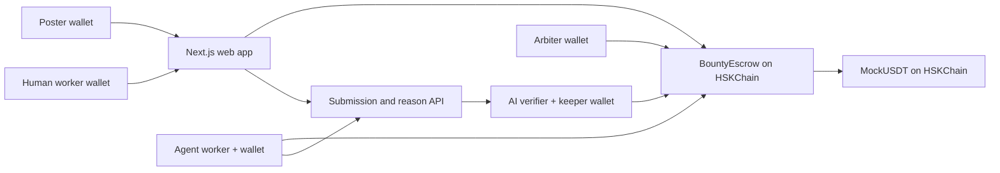

# Technical architecture and roadmap

## Tracks and problem

- **EAG:** AI x Ethereum & Agent Economy.
- **HSKChain:** AI Agents / AI × Web3 / Payments. The deployed escrow, token transfers, wallet interactions, event indexing and explorer links all run on HSKChain testnet.

The user problem is delayed or withheld payment after freelance work. The poster locks a reward before work starts. DeepSeek gives an assessment against predeclared criteria. The poster can accept work the model rejected or challenge an approval; a human arbiter resolves disputes. After the challenge window, `claim` is permissionless and a keeper calls it automatically while online.

## Components



`BountyEscrow` stores poster, worker, amount, criteria, deadline, submission URI/hash, reason hash, approval time and status. The text submission and AI reason live in the Node service. The web app checks the reason hash against the on-chain value. The verifier also validates the submission's content hash before asking the model.

## State machine

```text
Open --accept--> Taken --submit--> Submitted --pass--> Approved --60s, claim--> Paid
  |                  |                 |                |
  |                  |                 +--fail--> Taken  +--dispute--> Disputed
  +--deadline/refund-+                                       | resolve
  |                                                          +--> Paid or Refunded
  +--------------------------------------------------------------> Refunded
```

Every state change emits a contract event. Before committing an AI rejection, the verifier holds its recommendation in the private service for five minutes. The poster can give a reason and approve the work; the verifier then commits a passing result with a reason hash covering the human decision and the original AI finding. Without a human approval, failed verification returns to `Taken` for resubmission. In `Approved`, only the poster can dispute before `approvedAt + challengeWindow`; a human arbiter then chooses payment or refund. At or after the challenge deadline, any account can call `claim`. The keeper in `verifier.ts` checks the latest block timestamp every eight seconds and submits `claim` when eligible. A decision already committed to the deployed immutable contract cannot be changed in place.

## AI and integrity path

1. Agent listens for `BountyCreated`, signs `accept`, generates a deliverable with the configured model, stores the text, then signs `submit` with `keccak256(UTF-8 text)`.
2. Verifier listens for `Submitted`, accepts only submission URLs from its configured store, fetches the text, checks its hash, and asks the model for `{pass, score, reason}`.
3. Verifier validates the JSON shape. It commits an AI approval immediately. For an AI rejection, it stores a pending recommendation, accepts a signed posting-wallet decision for five minutes, then signs `verify(id, finalPass, keccak256(UTF-8 finalReason))`. The final report marks whether the poster overrode the model.
4. UI checks that the displayed reason and the service's hash match the on-chain reason hash.

The content and criteria are untrusted model inputs. The prompt instructs the model to treat them as data, but this is not a complete defense against prompt injection. The poster may challenge an AI approval within the challenge window; the demo arbiter is a single trusted human-controlled wallet. The poster cannot unilaterally refund an approved task.

## Security boundaries

- Contract uses OpenZeppelin `SafeERC20` and `ReentrancyGuard`, updates status before transfers, rejects invalid transitions and restricts verifier/arbiter operations.
- Deployer, agent, verifier and arbiter keys remain in ignored `.env`; no private keys are sent to the browser.
- `MockUSDT` is freely mintable and unsuitable for production or real settlement.
- The local service requires a shared server secret for private endpoints. The web proxy requires a signed wallet session and checks the on-chain poster or worker for private requests. During a dispute, the on-chain arbiter can read the deliverable and report, then resolve payment or refund in the UI. It accepts text up to 20,000 characters and uses local JSON files; it lacks quotas and replicated storage.
- The web app bundles an AES-256-GCM encrypted snapshot of paid tasks. The export command verifies every included submission and reason against the corresponding on-chain hashes before encrypting it. Live writes still depend on the local service and temporary tunnel. On-chain criteria, addresses, amounts, statuses and hashes remain public; historical evidence once served publicly cannot be retracted.
- The on-chain hashes authenticate the submission text and reason text, not the displayed numeric score. The score remains a verifier-service record and should not be treated as a cryptographic proof of judgment quality.
- The keeper depends on an online process and gas. Permissionless `claim` provides a manual fallback.
- On new deployments, either participant may call `escalateVerificationTimeout` 10 minutes after the latest submission. This moves Submitted to Disputed without moving funds; the trusted arbiter must still resolve it. Older deployments do not support this recovery path.

## Validation

- Foundry: normal flow, rejection/resubmission, dispute/refund, early claim revert, verifier authorization, deadline refund and submitted-state refund guard.
- TypeScript typechecks for services and web; Next.js production build.
- HSKChain task #12: DeepSeek recommended rejection with a 0% score; the signed poster manually approved, the verifier committed a passing result, and the report's reason matched its on-chain hash. Anonymous and unrelated wallets could not read the pending recommendation.
- Local Anvil chain ID 133 end-to-end: token mint and approval, bounty creation, agent acceptance/submission, verifier approval, keeper release, worker token balance and displayed reason hash.
- HSKChain testnet RPC chain ID was queried live and returned `0x85` (133). Both contracts were deployed. Task #0 completed with a scripted verdict. Tasks #1–#3 completed with real `deepseek-flash` calls for worker and verifier, followed by automatic payouts. The worker's 400 mUSDT balance across four tasks and the transactions were checked on chain. The live Vercel page showed task #3 paid, with its reason matching the on-chain hash.

## Roadmap

1. Deploy and validate the implemented verifier timeout arbitration upgrade; add arbiter availability recovery in a future version.
2. Decentralized or multi-party verification and arbitration; stronger proof of model execution (for example TEE attestation).
3. Durable content-addressed storage and publicly reachable submission API.
4. Real stablecoin support only after contract security review and policy analysis.
5. Agent identity, reputation, task matching, and robust anti-spam economics.
